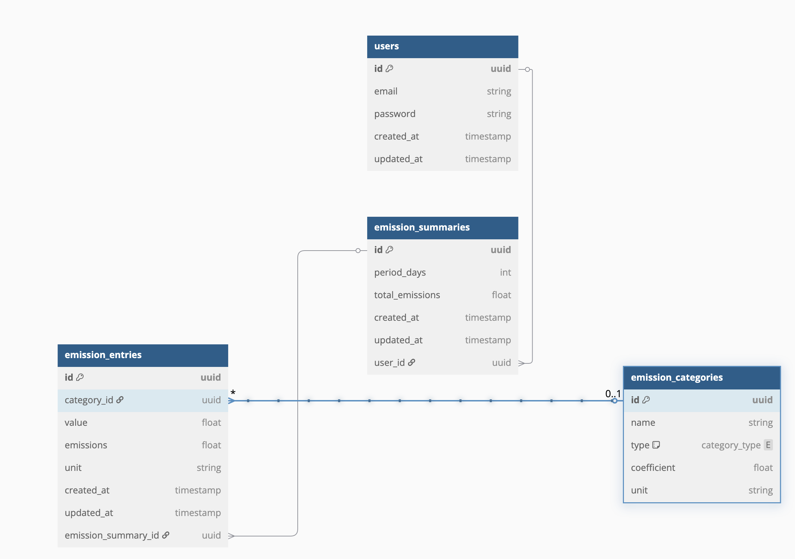

# Ceezer Carbon Emissions Calculator

Hey Ceezer team, ahead of our conversation for this Monday I created a small naive-approach poc for calculating and tracking carbon emissions across different categories like transportation, energy usage, and food consumption.

## Database Schema


## Prerequisites

- Node.js (v22 or higher) -- I just used nvm to manage this
- Yarn package manager
- Docker and Docker Compose (for PostgreSQL database)

## Quick Start


2. **Install dependencies**
```bash
yarn install
```

3. **Set up environment**
```bash
cp .env.example .env
```
The default values in `.env.example` should work out of the box with the provided Docker setup. They include:
- Database connection URL
- PostgreSQL credentials
- Application port (3000)
- Node environment

4. **Start the database**
```bash
yarn up
```

5. **Apply database migrations**
```bash
yarn migrate
```

6. **Seed the database**
```bash
yarn seed
```

7. **Start the development server**
```bash
yarn start:dev
```

The API will be available at `http://localhost:3000`.
Swagger documentation is available at `http://localhost:3000/api`.

## Testing the API

### Available Test Data

The seeded database includes:
- A test user with ID: `ceezerAdminFakeUuid`
- Pre-configured emission categories with predictable IDs:
  - Transportation: `gasolineCarFakeUuid`, `electricCarFakeUuid`, `airplaneFakeUuid`, etc.
  - Energy: `electricityFakeUuid`, `naturalGasFakeUuid`, etc.
  - Food: `beefFakeUuid`, `chickenFakeUuid`, `vegetablesFakeUuid`

### Sample API Request

Create a new emission summary:
```bash
curl -X POST http://localhost:3000/emissions \
  -H "Content-Type: application/json" \
  -d '{
    "userId": "ceezerAdminFakeUuid",
    "periodDays": 30,
    "entries": [
      {
        "categoryId": "gasolineCarFakeUuid",
        "value": 40,
        "unit": "KM"
      },
      {
        "categoryId": "electricityFakeUuid",
        "value": 300,
        "unit": "KWH"
      },
      {
        "categoryId": "beefFakeUuid",
        "value": 2,
        "unit": "KG"
      }
    ]
  }'
```

## Available Commands

- `yarn up` - Start the PostgreSQL database container
- `yarn down` - Stop the database container
- `yarn down:clean` - Stop the container and remove volumes
- `yarn migrate` - Run database migrations
- `yarn seed` - Seed the database with initial data
- `yarn start:dev` - Start the development server with hot reload


## Project Structure

```
src/
├── controllers/    # API route controllers
├── services/       # Business logic
├── prisma/         # Database schema and migrations
└── main.ts         # Application entry point
```

## Database Management

- **Reset Database**: To reset the database, run:
  ```bash
  yarn down:clean
  yarn up
  yarn migrate
  yarn seed
  ```

- **New Migration**: To create a new migration after schema changes:
  ```bash
  yarn migration:create
  ```

## Troubleshooting

1. If the database connection fails:
   - Ensure Docker is running
   - Check if port 5432 is available
   - Verify .env configuration

2. If seeding fails:
   - Ensure migrations have been applied
   - Check database connection
   - Try resetting the database

## Contributing

1. Create a feature branch
2. Commit your changes
3. Push to the branch
4. Create a Pull Request
